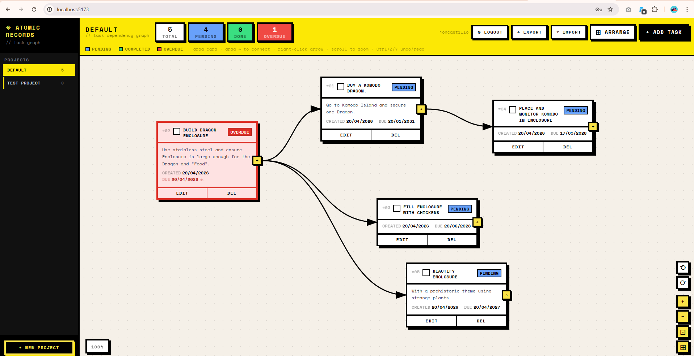

# Atomic Records

A task management app with a visual dependency graph that I **VIBE CODED**. Tasks are cards on a canvas; draw arrows between them to model dependencies. Each user has their own isolated set of projects.

 

## Features

- **Dependency graph** — drag cards to move, drag the port handle (→) on the right edge to connect tasks, right-click an arrow to remove it
- **Projects** — sidebar with named, colour-coded projects; each project has its own independent canvas (pan/zoom state resets per project)
- **Multi-user auth** — login/register with password; users only see their own projects
- **Undo / Redo** — Ctrl+Z / Ctrl+Y, or the ⟲ ⟳ buttons on the canvas
- **Auto-arrange** — topological layout based on dependency order
- **Export / Import** — full JSON dump; import upserts projects/tasks, never deletes existing data
- **Zoom & pan** — scroll to zoom, drag background to pan

## Tech stack

| Layer | Technology |
|-------|-----------|
| Frontend | React 18, TypeScript, Tailwind CSS, Vite |
| Backend | Express, better-sqlite3 |
| Auth | SQLite sessions, `crypto.scryptSync` password hashing |
| Deploy | Docker (multi-stage Alpine build) |

## Development

```bash
npm install
npm run dev        # starts Express (port 3210) + Vite dev server concurrently
```

Vite proxies `/api` to `http://localhost:3210`. The SQLite database is created at `data/records.db` on first run.

On first launch, the app will prompt you to create an admin account. That account automatically inherits any pre-existing projects in the database.

## Build

```bash
npm run build      # TypeScript check + Vite production build → dist/
npm run server     # serve production build on port 3210
```

## Docker

```bash
docker build -t dev_atomic_records .
docker run -d -p 3210:3210 -v /your/data/path:/app/data dev_atomic_records
```

The `data/` volume persists the SQLite database across container restarts.

> **Note:** The multi-stage Dockerfile compiles `better-sqlite3` natively for Alpine/musl inside the builder stage so the final image is self-contained.

## Deploy

```bash
bash deploy.sh
```

Rsyncs the project to `joncastillo@192.168.50.199:/mnt/sda/opt/dev_atomic_records`, then SSH-rebuilds and restarts the Docker container via `start_dev_atomic.sh`.

## Data model

```
users       id, username, password_hash, created_at
sessions    id, user_id, created_at
projects    id, user_id, name, color, created_at
tasks       id, project_id, title, description, created_date, due_date,
            completed, completed_date, depends_on (JSON array of task IDs)
positions   task_id, x, y
```

Task status is derived at runtime: **pending** (incomplete, not overdue), **overdue** (incomplete, past due date), **completed**.
